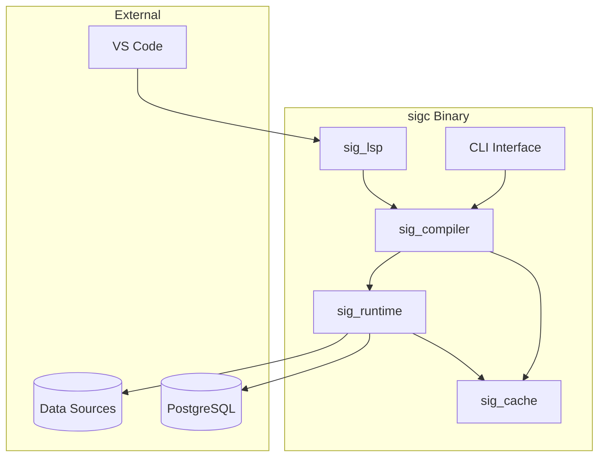
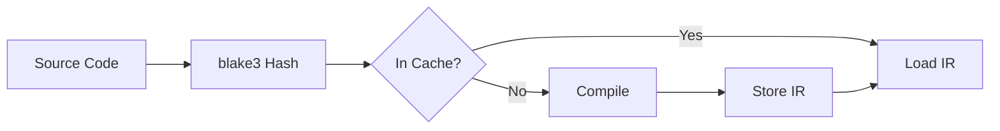
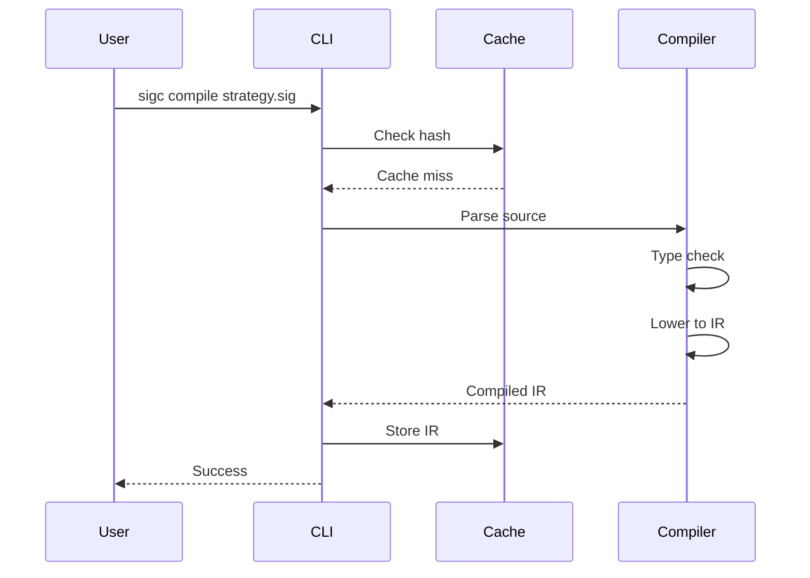
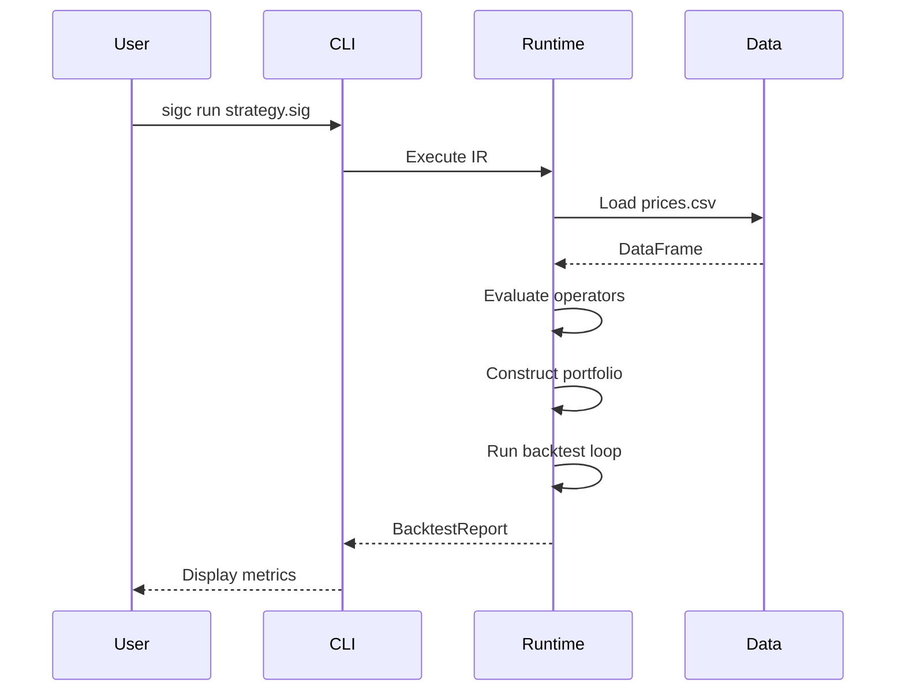
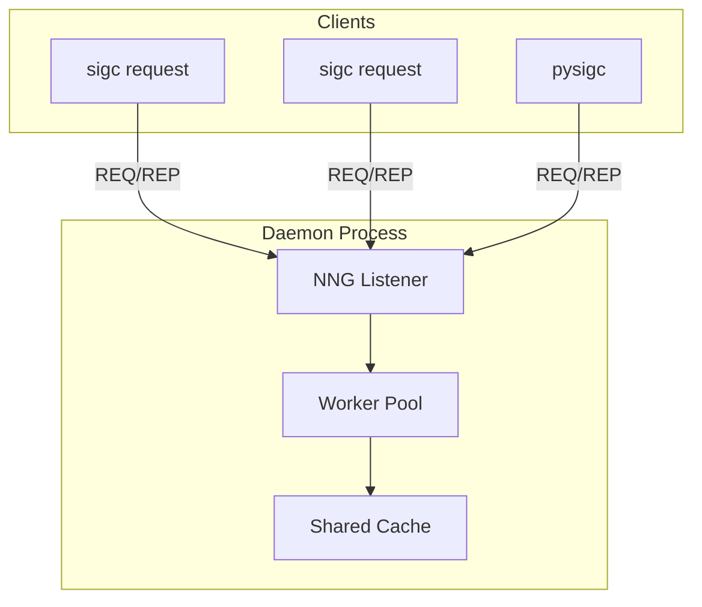

# Architecture

This page describes sigc's system architecture for developers who want to understand how it works under the hood.

## System Overview

sigc is a single binary that combines multiple components:



## Core Components

### 1. CLI (`sigc`)

The main entry point. Provides subcommands:

| Command | Description |
|---------|-------------|
| `compile` | Parse and type-check .sig file |
| `run` | Compile and execute backtest |
| `explain` | Show IR structure |
| `diff` | Compare strategies |
| `cache` | Manage cache |
| `daemon` | Start RPC server |
| `request` | Send commands to daemon |

**Location**: `crates/sigc/src/main.rs`

### 2. Compiler (`sig_compiler`)

Parses DSL and produces typed IR:


**Stages:**

1. **Parsing**: Chumsky-based parser → AST
2. **Type Checking**: Infer types, check constraints
3. **IR Lowering**: AST → Intermediate Representation
4. **Optimization**: Constant folding, dead code elimination

**Location**: `crates/sig_compiler/src/`

### 3. Runtime (`sig_runtime`)

Executes IR and runs backtests:

**Components:**

| Module | Purpose |
|--------|---------|
| `engine.rs` | Evaluates IR nodes |
| `backtest.rs` | Simulation loop |
| `kernels.rs` | Rolling statistics |
| `simd_kernels.rs` | SIMD-optimized ops |
| `costs.rs` | Transaction costs |
| `portfolio_opt.rs` | Optimization |
| `safety.rs` | Circuit breakers |

**Location**: `crates/sig_runtime/src/`

### 4. Types (`sig_types`)

Shared type definitions:

- `DType`: Data types (Float64, Int32, Bool, etc.)
- `Shape`: Tensor dimensions
- `Operator`: 120+ operators
- `Ir`: Intermediate representation
- `TypeAnnotation`: Combined dtype + shape

**Location**: `crates/sig_types/src/lib.rs`

### 5. Cache (`sig_cache`)

Content-addressed caching:



- **Backend**: sled embedded database
- **Hashing**: blake3 for speed
- **Contents**: Compiled IR, computed artifacts

**Location**: `crates/sig_cache/src/lib.rs`

### 6. Language Server (`sig_lsp`)

LSP implementation for IDE support:

- Real-time diagnostics
- Hover documentation
- Code completion
- Go-to-definition

**Location**: `crates/sig_lsp/src/main.rs`

### 7. Python Bindings (`pysigc`)

PyO3 bindings for notebooks:

```python
import pysigc
result = pysigc.backtest(source)
```

**Location**: `crates/pysigc/src/lib.rs`

## Data Flow

### Compilation Flow



### Execution Flow



## Daemon Architecture

For long-lived services, sigc supports daemon mode:



**Protocol**: NNG (nanomsg-next-gen) REQ/REP

**Commands:**

```bash
# Start daemon
sigc daemon --listen tcp://127.0.0.1:7240 --workers 8

# Send requests
sigc request ping
sigc request compile strategy.sig
sigc request run strategy.sig
sigc request status
sigc request shutdown
```

## Data Backend

### Columnar Storage

sigc uses Polars/Arrow for efficient data operations:

```
┌─────────────────────────────────────────┐
│              DataFrame                   │
├─────────┬─────────┬─────────┬───────────┤
│  date   │  AAPL   │  MSFT   │  GOOGL    │
├─────────┼─────────┼─────────┼───────────┤
│ 2024-01 │  185.64 │  374.58 │  140.25   │
│ 2024-02 │  184.25 │  373.31 │  139.12   │
│   ...   │   ...   │   ...   │   ...     │
└─────────┴─────────┴─────────┴───────────┘
        Columnar layout (cache-efficient)
```

### SIMD Optimization

Rolling statistics use SIMD instructions:

```rust
// SIMD-optimized rolling mean
pub fn rolling_mean_simd(data: &[f64], window: usize) -> Vec<f64> {
    // Uses AVX2/NEON for parallel computation
    ...
}
```

## Configuration

### Environment Variables

| Variable | Description | Default |
|----------|-------------|---------|
| `SIGC_CACHE_DIR` | Cache location | `~/.cache/sigc` |
| `SIGC_LOG_LEVEL` | Log verbosity | `info` |
| `AWS_ACCESS_KEY_ID` | S3 access | - |
| `AWS_SECRET_ACCESS_KEY` | S3 secret | - |

### TOML Configuration

```toml
# sigc.toml
[cache]
path = "/data/sigc_cache"

[database]
host = "localhost"
port = 5432
database = "sigc"

[execution]
workers = 8
simd = true

[backtest]
default_cost_bps = 5
```

## Error Handling

### Compiler Errors

Reported with source locations:

```
Error: Unknown function 'zsocre'
  --> strategy.sig:5:7
    |
  5 |   z = zsocre(returns)
    |       ^^^^^^
    |
help: Did you mean 'zscore'?
```

**Implementation**: `ariadne` crate for pretty-printing

### Runtime Errors

Wrapped in `Result` types:

```rust
pub fn execute(&mut self, ir: &Ir) -> Result<BacktestReport, RuntimeError> {
    ...
}
```

## Testing

### Test Structure

```
crates/sigc/tests/
├── integration.rs   # End-to-end tests
├── operators.rs     # Operator tests
└── strategies.rs    # Strategy parsing tests
```

### Running Tests

```bash
# All tests
cargo test

# Specific crate
cargo test -p sig_runtime

# With output
cargo test -- --nocapture
```

**Coverage**: 330+ tests across all crates

## Performance Considerations

### Memory Efficiency

- Columnar storage reduces memory bandwidth
- Memory-mapped files for large datasets
- Lazy evaluation where possible

### Parallelization

- Rayon for data-parallel operations
- SIMD for rolling computations
- Async I/O for database operations

### Caching

- Content-addressed caching avoids recomputation
- IR and intermediate results cached
- Cache invalidation via blake3 hashes

## Extending sigc

### Adding New Operators

1. Define operator in `sig_types`:

```rust
// In crates/sig_types/src/lib.rs
pub enum Operator {
    // ...existing...
    MyNewOp,
}
```

2. Implement in runtime:

```rust
// In crates/sig_runtime/src/engine.rs
fn eval_my_new_op(&self, inputs: &[Value]) -> Result<Value> {
    // Implementation
}
```

3. Add parser support:

```rust
// In crates/sig_compiler/src/parser.rs
"my_new_op" => Operator::MyNewOp
```

4. Add tests:

```rust
// In crates/sigc/tests/operators.rs
#[test]
fn test_my_new_op() {
    // Test implementation
}
```

### Adding New Data Sources

Implement the `Connector` trait:

```rust
pub trait Connector: Send + Sync {
    fn load(&self, query: &str) -> Result<DataFrame>;
    fn is_available(&self) -> bool;
}
```

## Next Steps

- [CLI Reference](../reference/cli.md) - Command details
- [Rust API](../api/rust/index.md) - Programmatic usage
- [Contributing](../contributing/index.md) - Development setup
