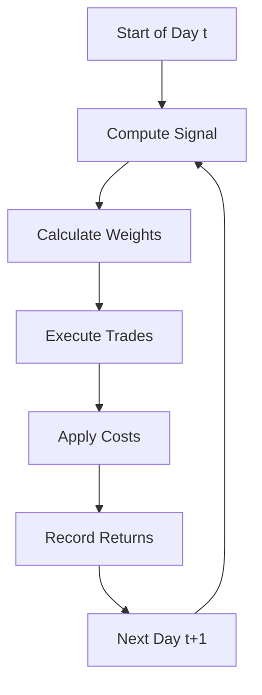
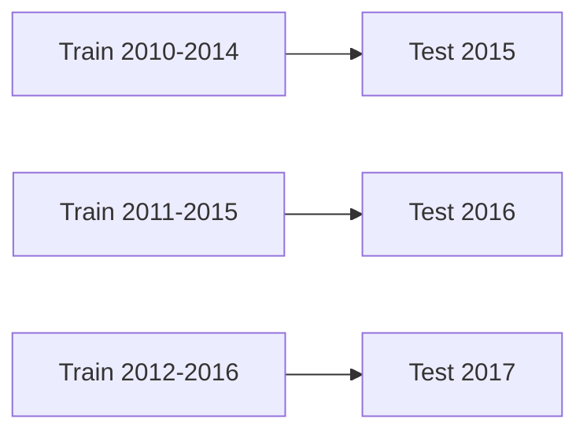

# Backtesting Fundamentals

Backtesting simulates how a strategy would have performed historically. This page covers the methodology and key concepts.

## What Is Backtesting?

Backtesting answers: "If I had traded this strategy historically, what would the results have been?"

```sig
portfolio main:
  weights = rank(momentum).long_short(top=0.2, bottom=0.2)
  backtest from 2020-01-01 to 2024-12-31
```

```
=== Backtest Results ===
Total Return:         45.23%
Annualized Return:    10.12%
Sharpe Ratio:          1.23
Max Drawdown:         12.45%
Turnover:            285.00%
```

## Backtest Methodology

### Daily Simulation Loop



### Timeline

For each trading day:

1. **Signal Calculation**: Compute signal using data through day t-1
2. **Weight Determination**: Convert signals to target weights
3. **Trade Execution**: Rebalance portfolio to target weights
4. **Cost Application**: Deduct transaction costs
5. **Return Calculation**: Compute day's P&L

### Look-Ahead Bias

sigc prevents look-ahead bias by ensuring signals use only past data:

```sig
signal momentum:
  // ret(prices, 20) on day t uses prices[t-20:t-1]
  // NOT prices[t] (today's price)
  returns = ret(prices, 20)
  emit zscore(returns)
```

!!! warning "Avoid Look-Ahead Bias"
    Look-ahead bias occurs when a signal uses future information. This makes backtests unrealistically good. sigc's design prevents this, but be careful with external data.

## Performance Metrics

### Return Metrics

| Metric | Formula | Interpretation |
|--------|---------|----------------|
| Total Return | $(P_{end} - P_{start}) / P_{start}$ | Cumulative gain/loss |
| Annualized Return | $(1 + R_{total})^{252/days} - 1$ | Yearly equivalent |
| CAGR | Same as annualized | Compound annual growth |

### Risk-Adjusted Metrics

| Metric | Formula | Good Value |
|--------|---------|------------|
| Sharpe Ratio | $\mu / \sigma$ (annualized) | > 1.0 |
| Sortino Ratio | $\mu / \sigma_{down}$ | > 1.5 |
| Calmar Ratio | Return / Max Drawdown | > 1.0 |

### Drawdown Metrics

| Metric | Description | Good Value |
|--------|-------------|------------|
| Max Drawdown | Largest peak-to-trough decline | < 15% |
| Avg Drawdown | Mean of all drawdowns | < 5% |
| Drawdown Duration | Time to recover from max DD | < 1 year |

### Trading Metrics

| Metric | Description | Typical Value |
|--------|-------------|---------------|
| Turnover | Annual portfolio churn | 200-500% |
| Win Rate | % of positive days | 50-55% |
| Profit Factor | Avg win / Avg loss | > 1.5 |

## Interpreting Results

### Good Backtest

```
Total Return:         85.00%
Annualized Return:    17.50%
Sharpe Ratio:          1.85
Max Drawdown:          9.20%
Turnover:            220.00%
```

- High Sharpe (> 1.5)
- Reasonable drawdown (< 15%)
- Moderate turnover

### Suspicious Backtest

```
Total Return:        450.00%
Annualized Return:    95.00%
Sharpe Ratio:          5.20
Max Drawdown:          2.10%
Turnover:            800.00%
```

- Sharpe > 3 is rare in practice
- Very low drawdown is suspicious
- High turnover may indicate overfitting

### Warning Signs

1. **Sharpe > 3**: Likely overfitting or look-ahead bias
2. **No drawdowns**: Strategy may be unrealistic
3. **Turnover > 1000%**: Excessive trading
4. **Only recent performance**: May not generalize

## Common Pitfalls

### Overfitting

Fitting too closely to historical data:

```sig
// Bad: Too many tuned parameters
params:
  lookback = 17      // Why 17?
  skip = 3           // Why 3?
  winsor_pct = 0.023 // Suspiciously precise
```

**Solutions:**

- Use simple, well-motivated parameters
- Test out-of-sample
- Use walk-forward optimization

### Survivorship Bias

Only testing stocks that exist today:

**Problem:** A 2010 backtest that excludes Lehman Brothers, Enron, etc.

**Solutions:**

- Include delisted securities
- Use point-in-time constituents
- Be skeptical of perfect data

### Transaction Cost Underestimation

```sig
// Too optimistic
costs = tc.bps(1)

// More realistic for equities
costs = tc.bps(5) + slippage.model("square-root", coef=0.1)
```

### Data Snooping

Testing many strategies and reporting the best:

**Problem:** If you test 100 strategies, some will look good by chance.

**Solutions:**

- Pre-specify hypotheses
- Adjust for multiple testing
- Validate on holdout data

## Best Practices

### 1. Split Data

```
Full Period: 2010-2024
├── In-Sample (Training): 2010-2019
└── Out-of-Sample (Testing): 2020-2024
```

Develop strategy on training data, validate on test data.

### 2. Walk-Forward Testing



See [Walk-Forward Optimization](../backtesting/walk-forward.md).

### 3. Realistic Cost Modeling

Include:

- Commission: 1-5 bps
- Spread: 1-10 bps
- Market impact: depends on size
- Borrowing costs: for shorts

### 4. Multiple Time Periods

Test across different market regimes:

- Bull markets (2010-2019)
- Bear markets (2008-2009, 2020, 2022)
- High volatility (2008, 2020)
- Low volatility (2017)

### 5. Sensitivity Analysis

Test robustness to parameter changes:

```bash
# Test different lookbacks
sigc run strategy_10d.sig
sigc run strategy_20d.sig
sigc run strategy_40d.sig

# Compare results
sigc diff strategy_10d.sig strategy_20d.sig
```

## Backtest Configuration

### Date Range

```sig
portfolio main:
  weights = ...
  backtest from 2020-01-01 to 2024-12-31
```

### Rebalancing Frequency

```sig
// Daily (default)
backtest from 2020-01-01 to 2024-12-31

// Weekly
backtest rebal=5 from 2020-01-01 to 2024-12-31

// Monthly
backtest rebal=21 from 2020-01-01 to 2024-12-31
```

### Benchmark

```sig
backtest benchmark=SPY from 2020-01-01 to 2024-12-31
```

Enables alpha, beta, and tracking error calculations.

### Transaction Costs

```sig
portfolio main:
  weights = ...
  costs = tc.bps(5) + slippage.model("square-root", coef=0.1)
  backtest from 2020-01-01 to 2024-12-31
```

## Analyzing Results

### Export to JSON

```bash
sigc run strategy.sig --output results.json
```

### Compare Strategies

```bash
sigc diff strategy_a.sig strategy_b.sig
```

### View IR

```bash
sigc explain strategy.sig
```

## Next Steps

- [Performance Metrics](../backtesting/metrics.md) - Detailed metrics
- [Transaction Costs](../backtesting/cost-models.md) - Cost modeling
- [Walk-Forward](../backtesting/walk-forward.md) - Out-of-sample testing
- [Type System](type-system.md) - How sigc ensures correctness
