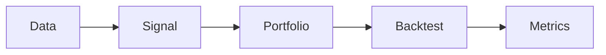

# Core Concepts

Understanding sigc's core concepts will help you build better trading strategies.

## Overview

sigc is built around four fundamental concepts:

1. **Signals** - Numerical scores that rank assets
2. **Portfolios** - Weight allocations based on signals
3. **Backtests** - Historical simulations of portfolio performance
4. **Type System** - Compile-time checking of operations



## Quick Concept Map

| Concept | What It Is | Example |
|---------|------------|---------|
| [Signal](signals.md) | Score per asset | Momentum, value, quality |
| [Portfolio](portfolio-construction.md) | Weight allocation | Long/short, long-only |
| [Backtest](backtesting.md) | Historical simulation | 2020-2024 test |
| [Type System](type-system.md) | Safety checking | Shape, dtype inference |

## The sigc Workflow

### 1. Load Data

```sig
data:
  prices: load csv from "data/prices.csv"
```

Data flows into the system as time-series matrices (dates × assets).

### 2. Define Signals

```sig
signal momentum:
  returns = ret(prices, 20)
  emit zscore(returns)
```

Signals transform data into scores that rank assets at each point in time.

### 3. Construct Portfolios

```sig
portfolio main:
  weights = rank(momentum).long_short(top=0.2, bottom=0.2)
```

Portfolio construction converts scores into tradeable weights.

### 4. Run Backtests

```sig
  backtest from 2020-01-01 to 2024-12-31
```

Backtesting simulates the strategy over historical data.

### 5. Analyze Results

```
=== Backtest Results ===
Sharpe Ratio:    1.45
Max Drawdown:    8.12%
```

Metrics quantify strategy performance.

## Key Principles

### Reproducibility

sigc guarantees deterministic results:

- Same inputs → same outputs, always
- Content-addressed caching with blake3 hashes
- No hidden randomness or state

### Type Safety

The type system catches errors at compile time:

```sig
signal bad:
  x = ret(prices, 20)      // Returns: time-series
  y = zscore(x)            // Error: zscore expects cross-sectional
```

Learn more in [Type System](type-system.md).

### Composability

Build complex strategies from simple components:

```sig
fn vol_adj(x, lookback):
  x / rolling_std(ret(x, 1), lookback)

macro momentum_signal(px: expr, lookback: number = 20):
  let r = ret(px, lookback)
  emit zscore(vol_adj(r, 60))

signal combo:
  mom = momentum_signal(prices)
  rev = -zscore(ret(prices, 5))
  emit 0.7 * mom + 0.3 * rev
```

## Section Overview

| Page | Description |
|------|-------------|
| [Signals](signals.md) | What signals are and how to build them |
| [Portfolio Construction](portfolio-construction.md) | Converting signals to weights |
| [Backtesting](backtesting.md) | Simulation methodology |
| [Type System](type-system.md) | Shape-aware type checking |
| [Architecture](architecture.md) | System components and design |

## Next Steps

Start with [What Are Signals?](signals.md) to understand the foundation of sigc strategies.
