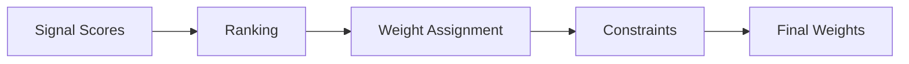

# Portfolio Construction

Portfolio construction converts signals into tradeable portfolio weights.

## Overview

The portfolio construction process:



## Basic Portfolio Construction

### Long-Short Portfolio

The most common approach: long winners, short losers.

```sig
portfolio main:
  weights = rank(momentum).long_short(top=0.2, bottom=0.2)
  backtest from 2024-01-01 to 2024-12-31
```

This creates:

- **Long**: Top 20% of assets (positive weights)
- **Short**: Bottom 20% of assets (negative weights)
- **Neutral**: Middle 60% (zero weight)

### Weight Distribution

With `long_short(top=0.2, bottom=0.2)` and 100 assets:

```
Position    Count   Weight Each   Total
Long        20      +5%           +100%
Neutral     60      0%            0%
Short       20      -5%           -100%
------------------------------------------
Net Exposure                      0%
Gross Exposure                    200%
```

## Ranking

The `rank()` function converts raw scores to uniform ranks:

```sig
signal example:
  raw_scores = zscore(ret(prices, 20))
  emit raw_scores

portfolio main:
  // rank() converts scores to 0-1 range
  weights = rank(example).long_short(top=0.2, bottom=0.2)
```

### Rank vs Raw Scores

| Approach | Pros | Cons |
|----------|------|------|
| `rank(signal)` | Robust to outliers | Ignores signal magnitude |
| `signal` directly | Uses signal strength | Sensitive to outliers |

## Weight Schemes

### Equal-Weighted Long-Short

```sig
portfolio equal_weight:
  weights = rank(momentum).long_short(top=0.2, bottom=0.2)
```

Each long position: `+1 / (N * top_pct)`
Each short position: `-1 / (N * bottom_pct)`

### Signal-Weighted

Weight proportional to signal strength:

```sig
signal momentum:
  scores = zscore(ret(prices, 20))
  cleaned = winsor(scores, p=0.01)
  emit cleaned

portfolio signal_weight:
  // Scale signal to sum to desired gross exposure
  long_mask = momentum > 0
  short_mask = momentum < 0
  scaled = scale(abs(momentum))
  weights = where(long_mask, scaled, -scaled)
```

### Position Caps

Limit individual position sizes:

```sig
portfolio capped:
  weights = rank(momentum).long_short(top=0.2, bottom=0.2, cap=0.05)
```

With `cap=0.05`, no single position exceeds 5% of portfolio.

## Portfolio Types

### Dollar-Neutral (Long-Short)

Net exposure = 0

```sig
portfolio dollar_neutral:
  weights = rank(signal).long_short(top=0.2, bottom=0.2)
  // Sum of longs = Sum of shorts (in absolute terms)
```

### Long-Only

No short positions:

```sig
portfolio long_only:
  // Only go long top performers
  scores = rank(signal)
  top_mask = scores > 0.8  // Top 20%
  weights = where(top_mask, scale(scores), 0)
```

### Beta-Neutral

Net beta = 0

```sig
portfolio beta_neutral:
  raw = rank(signal).long_short(top=0.2, bottom=0.2)
  // Adjust weights to achieve beta=0
  // (requires beta estimates)
```

### Sector-Neutral

Equal sector exposure to benchmark:

```sig
signal sector_neutral:
  raw = zscore(ret(prices, 20))
  neutral = neutralize(raw, by=sector)
  emit neutral

portfolio sector_balanced:
  weights = rank(sector_neutral).long_short(top=0.2, bottom=0.2)
```

## Constraints

### Position Limits

```sig
portfolio constrained:
  weights = rank(signal).long_short(
    top=0.2,
    bottom=0.2,
    cap=0.05  // Max 5% per position
  )
```

### Turnover Limits

Limit daily trading (in Rust API):

```rust
let constraints = ConstraintSet::new()
    .with_turnover(0.25);  // Max 25% one-way turnover
```

### Sector Limits

Via Rust API:

```rust
let constraints = ConstraintSet::new()
    .add_sector(SectorConstraint {
        sector: "Technology".to_string(),
        max_weight: Some(0.30),  // Max 30% in tech
    });
```

## Rebalancing

### Daily Rebalancing

```sig
portfolio daily:
  weights = rank(signal).long_short(top=0.2, bottom=0.2)
  backtest from 2024-01-01 to 2024-12-31
  // Rebalances every day by default
```

### Periodic Rebalancing

```sig
portfolio weekly:
  weights = rank(signal).long_short(top=0.2, bottom=0.2)
  backtest rebal=5 from 2024-01-01 to 2024-12-31
  // Rebalances every 5 days
```

### Monthly Rebalancing

```sig
portfolio monthly:
  weights = rank(signal).long_short(top=0.2, bottom=0.2)
  backtest rebal=21 from 2024-01-01 to 2024-12-31
  // Rebalances every 21 days (approx monthly)
```

## Transaction Costs

### Basic Cost Model

```sig
portfolio with_costs:
  weights = rank(signal).long_short(top=0.2, bottom=0.2)
  costs = tc.bps(5)  // 5 basis points
  backtest from 2024-01-01 to 2024-12-31
```

### Advanced Cost Model

```sig
portfolio institutional:
  weights = rank(signal).long_short(top=0.2, bottom=0.2)
  costs = tc.bps(5) + slippage.model("square-root", coef=0.1)
  backtest from 2024-01-01 to 2024-12-31
```

See [Transaction Costs](../backtesting/cost-models.md) for details.

## Multi-Signal Portfolios

### Signal Combination (Before Ranking)

```sig
signal combo:
  mom = zscore(ret(prices, 60))
  rev = -zscore(ret(prices, 5))
  emit 0.6 * mom + 0.4 * rev

portfolio combined:
  weights = rank(combo).long_short(top=0.2, bottom=0.2)
```

### Portfolio Combination (After Ranking)

In Rust API:

```rust
let mom_weights = backtest(&mom_plan)?;
let rev_weights = backtest(&rev_plan)?;

// Combine portfolio weights
let combined = 0.6 * mom_weights + 0.4 * rev_weights;
```

## Performance Attribution

### By Position

Track contribution of each position:

```rust
let attribution = AttributionAnalyzer::new();
let result = attribution.by_position(&returns, &weights);
```

### By Factor

Decompose returns by factor exposure:

```rust
attribution.add_factor("momentum", mom_returns);
attribution.add_factor("value", value_returns);
let result = attribution.analyze(&portfolio_returns)?;
```

See [Returns Attribution](../backtesting/attribution.md) for details.

## Best Practices

### 1. Use Ranking

Ranking is robust to signal scale and outliers:

```sig
// Good
weights = rank(signal).long_short(...)

// Risky (sensitive to outliers)
weights = signal.long_short(...)
```

### 2. Apply Position Caps

Prevent concentration risk:

```sig
weights = rank(signal).long_short(top=0.2, bottom=0.2, cap=0.05)
```

### 3. Consider Turnover

High turnover = high costs:

```sig
// Lower turnover: longer lookback
signal slow_momentum:
  emit zscore(ret(prices, 60))  // 60-day lookback

// Higher turnover: shorter lookback
signal fast_momentum:
  emit zscore(ret(prices, 5))   // 5-day lookback
```

### 4. Match Rebalancing to Signal Horizon

- Fast signals → frequent rebalancing
- Slow signals → infrequent rebalancing

### 5. Model Costs Realistically

Include all costs: commissions, spread, impact, borrowing.

## Next Steps

- [Backtesting Fundamentals](backtesting.md) - Simulation methodology
- [Transaction Costs](../backtesting/cost-models.md) - Cost modeling
- [Portfolio Constraints](../backtesting/constraints.md) - Advanced constraints
