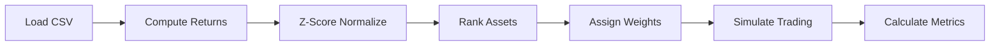

# 5-Minute Quickstart

Get your first signal running in 5 minutes.

!!! tip "Prerequisites"
    Make sure you've [installed sigc](installation.md) before continuing.

## Step 1: Create Sample Data

Create a directory for your project and add sample price data:

```bash
mkdir my-strategy && cd my-strategy
mkdir data
```

Create `data/prices.csv` with daily price data:

```csv
date,AAPL,MSFT,GOOGL,AMZN,META
2024-01-02,185.64,374.58,140.25,151.94,346.29
2024-01-03,184.25,373.31,139.12,149.93,344.47
2024-01-04,181.91,367.94,137.98,147.44,343.19
2024-01-05,181.18,367.75,136.69,148.47,347.12
2024-01-08,185.56,374.23,139.45,150.23,349.87
2024-01-09,186.12,375.89,140.87,151.67,351.23
2024-01-10,187.45,378.12,142.34,153.12,353.45
2024-01-11,188.23,379.67,143.56,154.45,355.12
2024-01-12,189.67,381.23,144.89,155.89,357.34
2024-01-16,190.45,382.45,145.67,156.67,358.67
```

!!! note "Sample Data"
    A complete sample dataset is available in the [documentation assets](../assets/sample-data/prices.csv) or at `docs/assets/sample-data/` in the sigc repository.

## Step 2: Write Your First Signal

Create `my_signal.sig`:

```sig
data:
  prices: load csv from "data/prices.csv"

params:
  lookback = 5

signal momentum:
  returns = ret(prices, lookback)
  score = zscore(returns)
  emit score

portfolio main:
  weights = rank(momentum).long_short(top=0.4, bottom=0.4)
  backtest from 2024-01-02 to 2024-01-16
```

### What This Does

1. **`data:`** - Loads price data from a CSV file
2. **`params:`** - Defines a tunable parameter (5-day lookback)
3. **`signal momentum:`** - Computes 5-day returns and normalizes them
4. **`portfolio main:`** - Longs top 40% performers, shorts bottom 40%
5. **`backtest`** - Runs simulation from Jan 2 to Jan 16, 2024

## Step 3: Compile

Validate your signal compiles correctly:

```bash
sigc compile my_signal.sig
```

Expected output:

```
INFO sigc: sigc v0.10.0
INFO sig_compiler: Parsing source
INFO sig_compiler: Parsed 1 data, 1 params, 1 signals, 1 portfolios
INFO sig_compiler: Lowered to 5 IR nodes
INFO sigc: Compilation complete: 5 nodes
```

!!! success "Compilation passed"
    If you see "Compilation complete", your signal is syntactically correct and type-safe.

## Step 4: Run Backtest

Execute the backtest:

```bash
sigc run my_signal.sig
```

Expected output:

```
=== Backtest Results ===
Total Return:          2.15%
Annualized Return:    78.45%
Sharpe Ratio:          3.21
Max Drawdown:          0.82%
Turnover:            180.00%
```

!!! info "Metrics Explained"
    - **Total Return**: Cumulative return over the backtest period
    - **Annualized Return**: Return scaled to a yearly basis
    - **Sharpe Ratio**: Risk-adjusted return (higher is better)
    - **Max Drawdown**: Largest peak-to-trough decline
    - **Turnover**: How much the portfolio changes (annualized)

## Step 5: Export Results

Save results to JSON for further analysis:

```bash
sigc run my_signal.sig --output results.json
```

The JSON file contains:

```json
{
  "metrics": {
    "total_return": 0.0215,
    "annualized_return": 0.7845,
    "sharpe_ratio": 3.21,
    "max_drawdown": 0.0082,
    "turnover": 1.80
  },
  "returns_series": [...],
  "positions": {...}
}
```

## What Just Happened?

Here's the execution flow:



1. **Data loaded**: Prices were read from CSV into a columnar DataFrame
2. **Signal computed**: For each asset, computed 5-day returns then z-scored cross-sectionally
3. **Weights assigned**: Ranked assets, assigned +weight to top 40%, -weight to bottom 40%
4. **Backtest run**: Simulated daily rebalancing
5. **Metrics calculated**: Sharpe, drawdown, turnover computed from daily returns

## Try It: Modify the Strategy

### Change the Lookback Period

Edit `my_signal.sig`:

```sig
params:
  lookback = 10  # Changed from 5 to 10
```

Run again and compare results:

```bash
sigc run my_signal.sig
```

### Add Winsorization

Clean outliers by adding `winsor`:

```sig
signal momentum:
  returns = ret(prices, lookback)
  score = zscore(returns)
  cleaned = winsor(score, p=0.05)  # Clip at 5th/95th percentile
  emit cleaned
```

### Compare Strategies

Save the original, modify, and compare:

```bash
# Rename original
mv my_signal.sig momentum_5d.sig

# Create new version with lookback=10
# ... edit file ...

# Compare
sigc diff momentum_5d.sig momentum_10d.sig
```

## Common Issues

### "Failed to load CSV"

Check the file path:

```bash
ls -la data/prices.csv
```

Ensure the path in your `.sig` file matches.

### "No data sources found"

Verify your `data:` block format:

```sig
data:
  prices: load csv from "path/to/file.csv"
```

### Low Sharpe Ratio

With limited data, results may be noisy. Try:

- Longer backtest period
- More assets in universe
- Different lookback parameters

## Next Steps

Now that you've run your first backtest:

- [Your First Strategy](first-strategy.md) - Build a more sophisticated strategy
- [DSL Basics](../language/syntax.md) - Learn the full language
- [Operators Reference](../operators/index.md) - Explore 120+ built-in operators
- [Strategy Library](../strategies/index.md) - Study 23 complete strategies
